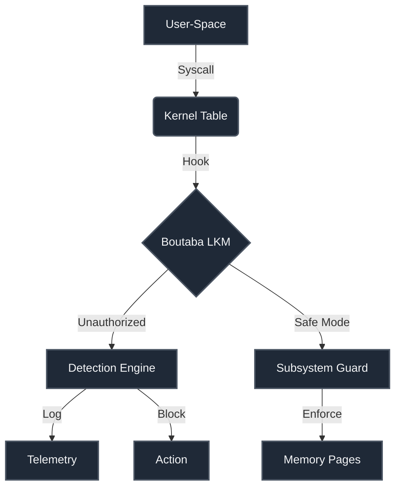

# Boutaba Kernel Hardening Engine (LKM)

##  Project Overview
A Linux Kernel Module (LKM) in C for system-space protection, focusing on mitigating privilege escalation via subsystem hooks and memory immutability.

---

##  Kernel Hardening Architecture (المخطط المعماري)



### Components
1. **Syscall Interception:** Monitors kernel boundaries.
2. **Safe-Vault Telemetry:** Secure runtime monitoring.
3. **Write-Protection:** Secures kernel data.

---

# Boutaba Kernel Hardening Engine (Arch Linux & MSYS2)

##  Project Overview
A low-level Linux Kernel Module (LKM) and auditor for **Arch Linux** with **MSYS2 (MinGW)** cross-compilation support.

##  Arch Linux Compilation & Deployment
```bash
# Arch: Setup & Build
sudo pacman -Syu --needed base-devel linux-headers
make

# Insert Module
sudo insmod boutaba_kernel_hardening.ko
```

##  MSYS2 Testing Platform
```bash
# MSYS2: Setup
pacman -Syu
pacman -S --needed base-devel mingw-w64-x86_64-toolchain
```


##  Component Breakdown

| Component | Function |
| :--- | :--- |
| **Syscall Hooking** | Control-flow integrity |
| **Memory Auditor** | Write Protect enforcement |
| **Telemetry Logger** | Stack tracking |
