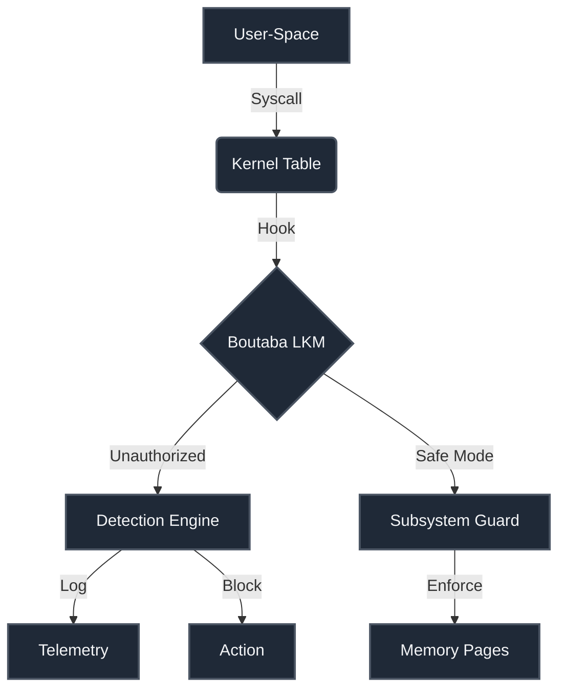

# Boutaba Kernel Hardening Engine (LKM)

##  Project Overview
A Linux Kernel Module (LKM) in C for system-space protection, focusing on mitigating privilege escalation via subsystem hooks and memory immutability.

---

##  Kernel Hardening Architecture (المخطط المعماري)



### Components
1. **Syscall Interception:** Monitors kernel boundaries.
2. **Safe-Vault Telemetry:** Secure runtime monitoring.
3. **Write-Protection:** Secures kernel data.

---

##  Project Goals (الهدف من المشروع)
*   Hardening Linux kernels.
*   Isolated logging.
*   Low-overhead protection.

---

##  Compilation & Testing (طريقة التشغيل)

```bash
# 1. Install headers
sudo apt-get install build-essential linux-headers-\$(uname -r)
# 2. Compile
make
# 3. Load
sudo insmod boutaba_kernel_hardening.ko
# 4. Verify
dmesg | grep -i "boutaba"
```

---

##  Component Breakdown

| Component | Function |
| :--- | :--- |
| **Syscall Hooking** | Control-flow integrity |
| **Memory Auditor** | Write Protect enforcement |
| **Telemetry Logger** | Stack tracking |
