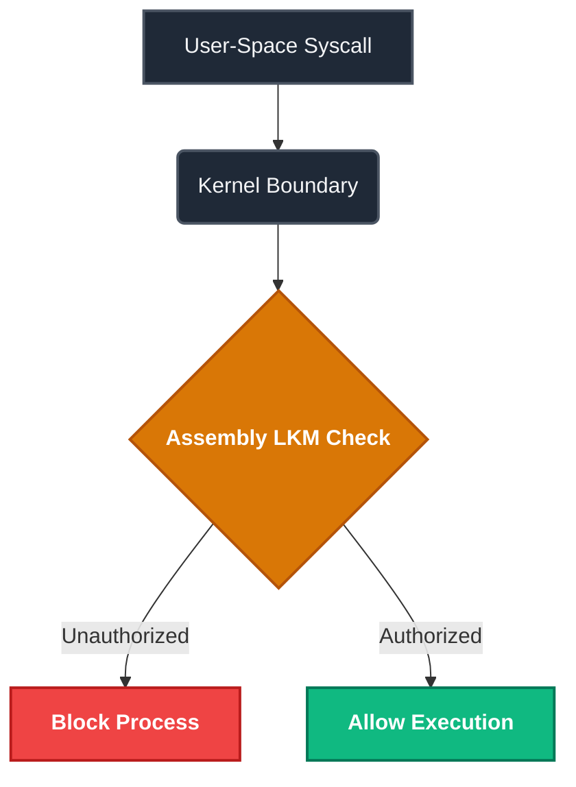

# Process-Watchdog-Auditor

## Overview
This repository contains a Linux Kernel Module (LKM) written in 100% pure x86_64 Assembly (NASM) for Arch Linux. It handles system-space protection by intercepting system calls directly at the kernel boundary to check process security and verify data integrity.

---

## Code Flow


---

## Build and Run
Make sure you have `nasm`, `make`, and `linux-headers` installed on your Arch Linux environment.

```bash
# Compile and build the kernel module automatically
make

# Insert the compiled module into the Linux kernel
sudo insmod watchdog_auditor.ko

# Remove the module from the kernel
sudo rmmod watchdog_auditor
```

---

## Project Structure (Makefile Code)
This is the Makefile used to track and build the assembly kernel module natively:

```makefile
ASM=nasm
ASMFLAGS=-f elf64
LD=ld

all: watchdog_auditor

watchdog_auditor: main.o
	\$(LD) main.o -o watchdog_auditor

main.o: main.asm
	\$(ASM) \$(ASMFLAGS) main.asm -o main.o

clean:
	rm -f *.o watchdog_auditor
```
